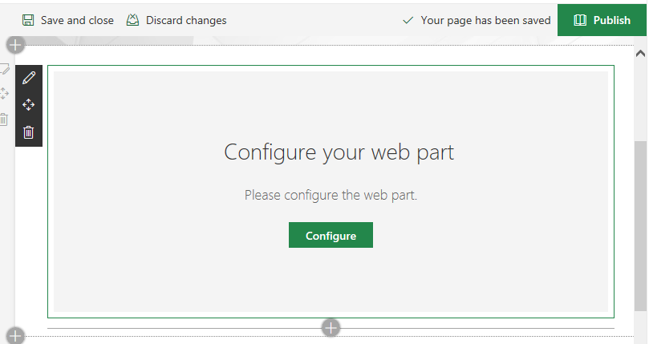
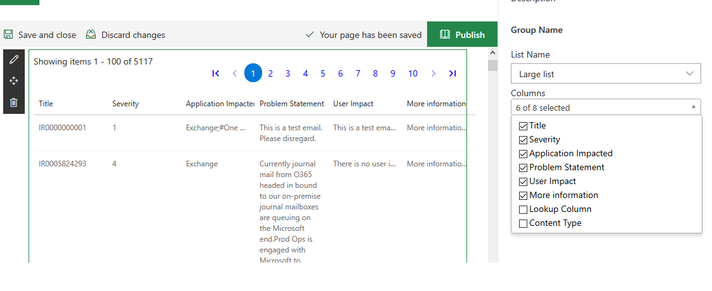
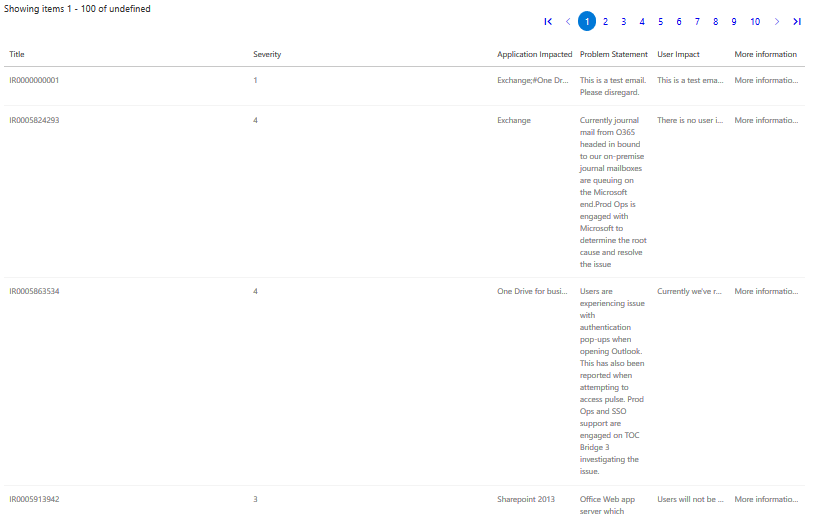

# Sharepoint Framework (SPFx) Large List Webpart using React & Office UI Components
SharePoint framework webpart to retrieve SharePoint list items using React & Rest API and display the results using details DetailsList Office UI fabric component
## Introduction
This webpart will retrieve SharePoint list items beyond the threshold limit and will display the results using DetailsList Office UI fabric component. Due to SharePoint list view threshold limit, users without admin rights will not be able to browse through the SharePoint list items. Adding and configuring this webpart will let users with at least read permissions to the site to view all items from the list .

## Using the Code
Listed below are the components that were created as part of this webpart:

1. Custom property pane - A custom property pane control to show a multiselect dropdown to populate the columns when the list property is selected. Please refer to this link to create Custom property pane control.
2. Config - Config component will be rendered if the webpart properties are not configured.
3. Paging - This is react paging component. This is used to add pagination to the list view.
4. ViewAllItems - The component that renders the DetailsList Office UI fabric component and binds the list items to it.
5. services - This contains the methods to get the Lists and Columns from SharePoint using Rest API.
### Package and Deploy
Clone the solution and make sure there is no error before packaging
```bash
git clone the repo
npm i
gulp serve
```
- Execute the following gulp task to bundle your solution. This executes a release build of your project by using a dynamic label as the host URL for your assets. This URL is automatically updated based on your tenant CDN settings:
```bash
gulp bundle --ship
```
- Execute the following task to package your solution. This creates an updated webpart.sppkg package on the sharepoint/solution folder.
```bash
gulp package-solution --ship
```
- Upload or drag and drop the newly created client-side solution package to the app catalog in your tenant.
- Based on your tenant settings, if you would not have CDN enabled in your tenant, and the includeClientSideAssets setting would be true in the package-solution.json, the loading URL for the assets would be dynamically updated and pointing directly to the ClientSideAssets folder located in the app catalog site collection.
## Screenshots of the output




This package produces the following:

* lib/* - intermediate-stage commonjs build artifacts
* dist/* - the bundled script, along with other resources
* deploy/* - all resources which should be uploaded to a CDN.
